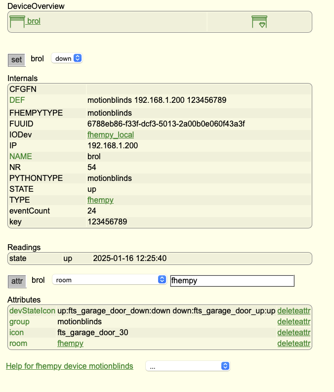

README.md

# MOTIONBLINDS for FHEM

## An FHEMPY module to make use of motionblinds python library

By the way this is my first attempts to define a python module for FHEM

A firne dof mine has BREL motors that are controlable by Homeassistant and would like his fhem instance to pilot them as well. 

The motors are connected through a [BREL HUB](https://www.brel-home.nl/nl/pro/producten/smart-home/353/hub-03) (ethernet/RF) and a library alread exist in python (the one used by homeassistant)

[motion-blinds library](https://github.com/starkillerOG/motion-blinds)

In order to use python code in fhem the [fhempy](https://github.com/fhempy/fhempy/tree/master) module has to be installed:

Dependencies:

in a terminal, issue the following command:

    sudo apt install python3 python3-pip python3-dev python3-venv libffi-dev libssl-dev libjpeg-dev zlib1g-dev autoconf build-essential libglib2.0-dev libdbus-1-dev bluez libbluetooth-dev git libprotocol-websocket-perl
    
    sudo cpan Protocol::WebSocket

In fhem's command line do:

    update add https://raw.githubusercontent.com/fhempy/fhempy/master/controls_pythonbinding.txt

    update

    shutdown restart
    
    define fhempy_local BindingsIo fhempy

In orer to include the library do the following in a terminal, the first line defines the virtual python environement, the se'cond installs the library in it.

    source /opt/fhem/.fhempy/fhempy_venv/bin/activate
    
    pip install motionblinds

The module should normally come up.

